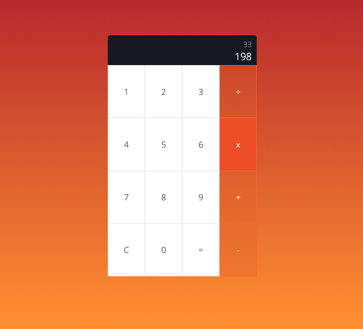

## Calculator App
Built a calculator without any frameworks or libraries.

## Deployment
https://msmfa.github.io/calculator/
## Screenshot

## Build Tools & Languages
- HTML
- CSS
- Javascript
- Visual Studio Code
- Git
- Github

## What did I learn? 
- CSS Gradients
- CSS Pseudo Selectors
- DOM Manipulation 
- HTML5 "action" case uses and uses

## Authors 
Michael Sydney Moore 
## License 
N/A
